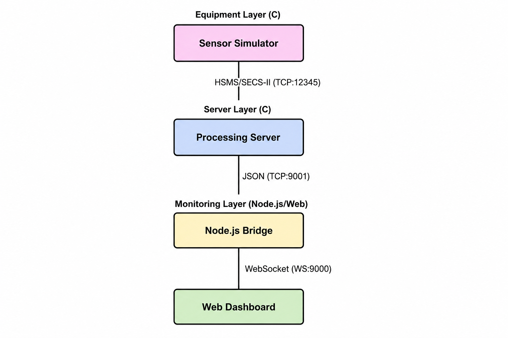
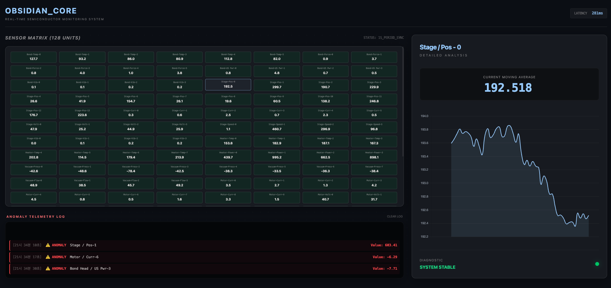
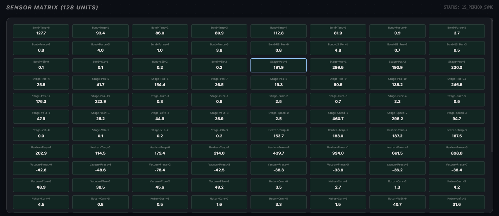
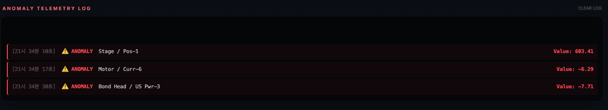
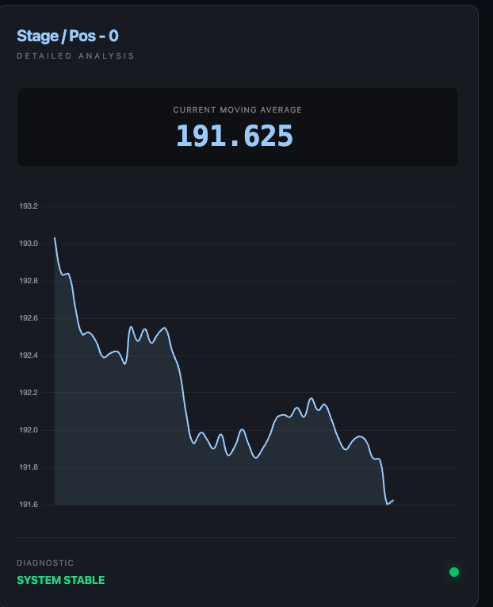

# 통합 실시간 데이터 모니터링 시스템 기술 보고서

본 보고서는 반도체/디스플레이 공정 장비의 실시간 센서 데이터를 생성, 처리 및 시각화하는 통합 시스템의 전반적인 기술 사양과 동작 원리를 상세히 기술한다.


---

## 목차 (Table of Contents)

1. [전체 시스템 아키텍처](#전체-시스템-아키텍처)
2. [실시간 데이터 처리 시스템 (Equipment) 분석](#실시간-데이터-처리-시스템-equipment-분석-보고서)
3. [실시간 데이터 처리 시스템 서버 기술 보고서 (Server)](#실시간-데이터-처리-시스템-서버-기술-보고서-server-technical-report)
4. [OBSIDIAN_CORE 모니터링 시스템 기술 보고서 (Monitor)](#obsidian_core-모니터링-시스템-기술-보고서)


---

# 전체 시스템 아키텍처

본 시스템은 **데이터 생성(Equipment)**, **데이터 분석 및 처리(Server)**, **실시간 시각화(Monitor)**의 3단계 파이프라인으로 구성되어 유기적으로 동작한다.

## 시스템 구성도




## 구성 요소별 핵심 역할

1.  **Equipment (장비 시뮬레이터)**
    *   **데이터 생성**: 128개의 센서(온도, 압력, 진동 등)를 8개의 독립적인 스레드로 시뮬레이션.
    *   **표준 통신**: 반도체 장비 표준인 **HSMS/SECS-II** 프로토콜을 바이너리 레벨에서 구현하여 전송 효율 극대화.
    *   **현실성**: 랜덤 노이즈 및 일정 확률의 이상치(Anomaly)를 삽입하여 실제 공정 환경 모사.

2.  **Server (분석 및 중계 서버)**
    *   **데이터 파싱**: 수신된 고속 바이너리 스트림을 실시간으로 디코딩하여 구조화된 데이터로 변환.
    *   **분석 로직**: 슬라이딩 윈도우 기반 **이동 평균(Moving Average)** 및 임계치 기반 **이상 징후 탐지(Anomaly Detection)** 수행.
    *   **데이터 저장 및 중계**: 가공된 데이터를 로그로 저장함과 동시에 모니터링 시스템을 위해 JSON 형식으로 실시간 전송.

3.  **Monitor (시각화 대시보드 시스템)**
    *   **중계 엔진 (Node.js Bridge)**: C 서버의 TCP 데이터를 수용하여 다수의 웹 클라이언트에 WebSocket으로 브로드캐스트.
    *   **고성능 대시보드 (Web)**: Vanilla JS 및 CSS3를 활용하여 128개 센서의 상태를 실시간으로 렌더링하고, 특정 센서의 트렌드를 Chart.js로 시각화.

## 데이터 흐름 요약
*   **Step 1**: 장비에서 발생한 **Raw Data**가 HSMS 규격에 맞춰 서버로 전송된다.
*   **Step 2**: 서버는 이를 분석하여 **Status Data**(평균값, 이상 유무 등)를 생성한다.
*   **Step 3**: 분석된 데이터는 브릿지를 거쳐 대시보드에 **Visual Data**로 최종 사용자에게 전달된다.


# 실시간 데이터 처리 시스템 (Equipment) 분석 보고서

이 섹션은 `real_time_data_processing_system`의 장비 시뮬레이터 프로그램에 대한 아키텍처와 통신 규격을 상세히 설명한다.

---

## 전체적인 아키텍처

본 프로그램은 반도체/디스플레이 제조 공정 장비의 센서 데이터를 실시간으로 시뮬레이션하고, 표준 통신 프로토콜인 SECS-II/HSMS 통해 서버로 전송하는 고성능 시뮬레이터다.

### 멀티스레드 기반 분산 처리
- **모듈별 독립 스레드**: 시스템 내부의 8개 주요 모듈(Bond Head, Stage, Heater 등)을 각각 독립적인 스레드로 구동한다.
- **동기화 및 공유 자원**: 모든 모듈 스레드는 하나의 네트워크 소켓(`global_sock`)을 공유하며, 데이터 전송 시 `pthread_mutex`를 사용하여 데이터 패킷의 원자성(Atomicity)과 안정성을 보장한다.
- **고정 크기 패킷**: 네트워크 전송 효율과 서버 측의 수신 안정성을 위해 모든 패킷은 **4096바이트 고정 크기**로 패딩되어 전송된다.

---

## Data Generator 상세 설명

데이터 생성기는 장비의 물리적 상태를 시뮬레이션하며, 각 센서의 특성에 맞는 주기와 데이터 범위를 가진다.

### Sensor ID 체계 (16-bit)
`sensor_id`는 하드웨어 구조를 반영하여 계층적으로 정의된다.

| 비트 범위 | 필드명 | 설명 |
| :--- | :--- | :--- |
| **Bit 12 ~ 15** | **Module** | 장비 내 물리적 모듈 (최대 16개) |
| **Bit 8 ~ 11** | **Sensor Type** | 측정 항목 (Temp, Force, Pos 등) |
| **Bit 0 ~ 7** | **Index** | 해당 모듈/타입 내 개별 식별 번호 (최대 256개) |

### 센서 구성 및 주기 (Configuration)
총 128개의 센서가 다음과 같이 구성되어 독립적인 주기로 데이터를 생성한다.

| 모듈 (Module) | 센서 타입 (Type) | 센서 수 | 주기 (ms) | 하한값 | 상한값 | 단위 | 설명 |
| :--- | :--- | :---: | :---: | :---: | :---: | :---: | :--- |
| **Bond Head** | Temperature | 6 | 100 | 60.0 | 150.0 | °C | 헤드 온도 |
| | Force | 6 | 50 | 0.2 | 5.0 | kgf | 가압력 |
| | Ultrasonic Power | 4 | 50 | 0.5 | 5.0 | W | 초음파 출력 |
| | Vibration | 4 | 200 | 0.0 | 0.3 | g | 진동 |
| **Stage** | Position Encoder | 14 | 20 | 0.0 | 300.0 | mm | 스테이지 위치 |
| | Motor Current | 6 | 50 | 0.2 | 2.5 | A | 모터 전류 |
| | Motor Voltage | 4 | 50 | 24.0 | 48.0 | V | 모터 전압 |
| | Motor Speed | 4 | 20 | 0.0 | 500.0 | mm/s | 모터 속도 |
| | Vibration | 4 | 200 | 0.0 | 0.2 | g | 진동 |
| **Heater** | Temperature | 8 | 200 | 100.0 | 250.0 | °C | 히터 온도 |
| | Power Consumption| 4 | 50 | 200.0 | 1000.0 | W | 전력 소모량 |
| **Vacuum** | Vacuum Pressure | 8 | 100 | -80.0 | -30.0 | kPa | 진공 압력 |
| | Flow | 4 | 200 | 5.0 | 50.0 | L/min | 가스 유량 |
| **Motor/Drive** | Motor Current | 10 | 50 | 0.5 | 5.0 | A | 구동 모터 전류 |
| | Motor Voltage | 6 | 50 | 24.0 | 48.0 | V | 구동 모터 전압 |
| | Motor Speed | 6 | 20 | 0.0 | 3000.0 | rpm | 구동 모터 속도 |
| | Vibration | 4 | 100 | 0.0 | 0.4 | g | 구동부 진동 |
| **Vision** | Vision Alignment | 5 | 100 | -5.0 | 5.0 | μm | 정렬 오차 |
| | Defect Detection | 5 | 200 | 0.0 | 1.0 | - | 결함 검출 여부 |
| **Environment**| Temperature | 5 | 1000 | 20.0 | 25.0 | °C | 외기 온도 |
| | Humidity | 2 | 1000 | 30.0 | 50.0 | %RH | 습도 |
| | Airflow | 3 | 1000 | 0.3 | 1.0 | m/s | 기류 |
| **Power** | Power Consumption| 6 | 500 | 2000.0 | 10000.0 | W | 장비 전체 전력 |

---

## 통신 프로토콜 (Protocol)

본 시스템은 반도체 장비 표준 통신 프로토콜인 **SECS/GEM**의 하위 계층을 구현한다.

### HSMS (High-Speed SECS Message Services)
HSMS는 TCP/IP 네트워크 환경에서 SECS-II 메시지를 교환하기 위한 전송 프로토콜이다. 모든 HSMS 메시지는 **4바이트의 Length 영역**과 **10바이트의 Header 영역**으로 시작된다.

#### HSMS 메시지 구조

| 필드명 | 크기 (Byte) | 설명 |
| :--- | :---: | :--- |
| **Message Length** | 4 | 뒤따르는 10바이트 Header와 SECS-II Body의 합계 길이를 나타낸다. (Big-endian) |
| **Session ID** | 2 | 장치 간의 논리적 통신 세션을 식별하기 위한 ID다. |
| **Header Byte 2** | 1 | **Stream 번호**: SECS-II 메시지의 카테고리를 지정한다. (SxFy의 S) |
| **Header Byte 3** | 1 | **Function 번호**: 각 Stream 내의 세부 기능을 지정한다. (SxFy의 F) |
| **P-Type** | 1 | **Protocol Type**: 프로토콜 타입을 정의하며, `0`은 SECS-II 전송을 의미한다. |
| **S-Type** | 1 | **Session Type**: 메시지의 성격(Data, Select, Deselect 등)을 구분한다. `0`은 데이터 메시지다. |
| **System Bytes** | 4 | 요청-응답 매칭을 위한 고유 ID다. |

#### 본 시스템의 HSMS 구현 특징
- **Big-endian 준수**: `length`, `session_id`, `system_bytes` 등 1바이트를 초과하는 모든 필드는 네트워크 바이트 순서(Big-endian)를 준수하여 인코딩된다.
- **고정 크기 패킷 송신**: 실제 메시지 크기와 관계없이 **4096바이트 고정 크기** 패킷을 전송하여 서버 측에서의 데이터 읽기 경계 처리를 단순화하고 정렬 안정성을 확보했다.

---

### SECS-II (SEMI Equipment Communications Standard Part 2)
SECS-II는 장비와 호스트 간에 교환되는 메시지의 본문(Body) 형식을 정의하는 표준 프로토콜이다. 모든 데이터는 'Item'이라는 단위로 구성되며, 각 Item은 자체적인 타입 정보와 길이를 포함한다.

#### SECS-II Item 구조
각 Item은 **Item Header**와 **Data** 영역으로 나뉜다.
1. **Format Code & Length Byte (1 Byte)**: 데이터의 타입(6-bit)과 길이 필드의 크기(2-bit)를 나타낸다.
2. **Length Field (1~3 Bytes)**: 실제 데이터 영역의 크기를 바이트 단위로 나타낸다.
3. **Data Area**: 실제 데이터 값이 위치하며, 멀티바이트 숫자는 Big-endian 형식을 따른다.

#### 본 시스템에서 사용되는 주요 Format Code

| 타입명 | 코드 (Hex) | 설명 |
| :--- | :---: | :--- |
| **List (L)** | `0x01` | 서로 다른 타입의 Item들을 그룹화하는 트리 구조의 컨테이너다. |
| **Unsigned Integer (U8)** | `0xA1` | 8바이트 부호 없는 정수다. 본 시스템에서는 `Timestamp` 전송에 사용한다. |
| **Unsigned Integer (U2)** | `0xA9` | 2바이트 부호 없는 정수다. `Sensor ID` 및 `Data Count` 전송에 사용한다. |
| **Floating Point (F4)** | `0x91` | 4바이트 단정밀도 부동 소수점이다. 실제 `Sensor Value` 전송에 사용한다. |

#### S6F1 (Trace Data Send) 메시지 상세 구조
본 시스템은 실시간 센서 데이터를 보고하기 위해 S6F1 메시지를 사용하며, 다음과 같은 중첩 List 구조를 가진다.

- **Level 1 (Top List)**: 3개의 항목을 포함 (Timestamp, Count, Data List)
- **Level 2 (Data List)**: 현재 주기가 도래한 센서 개수만큼의 List를 포함
- **Level 3 (Data Item)**: 개별 센서의 [ID, Value] 쌍을 구성 (U2, F4)

---

## 데이터 흐름 (Data Flow)

장비 시뮬레이터가 구동되어 데이터를 생성하고 서버로 송신하기까지의 전 과정은 다음과 같은 순서로 진행된다.

### 초기화 단계 (Initialization)
프로그램 시작 시, `run()` 함수에서 센서 시스템의 기초를 구성한다.
1. **센서 메타데이터 정의 (`init_sensors`)**: 각 센서의 `sensor_id`, `period_ms`(주기)를 설정한다. 이때 각 센서의 첫 실행 시간(`next_time_ms`)을 랜덤하게 분산시켜 트래픽이 한꺼번에 몰리는 것을 방지한다.
2. **상태 메모리 할당 및 초기값 설정 (`init_sensor_states`)**: 센서의 실시간 값을 저장할 메모리를 할당한다. 정상 범위(Min/Max) 내에서 랜덤한 초기값을 부여하여 자연스러운 시작 상태를 만든다.
3. **네트워크 연결**: 서버와 TCP/IP 연결을 수립하고 전역 소켓 핸들(`global_sock`)을 확보한다.

### 데이터 생성 및 수집 (Generation & Collection)
8개의 모듈 스레드(`module_worker`)가 독립적으로 루프를 돌며 데이터를 생성한다.
1. **주기 판정**: 현재 시간(`get_time_ms`)과 센서별 `next_time_ms`를 비교하여 전송 주기가 도래한 센서만 선별한다.
2. **값 업데이트 (`update_sensor_value`)**: 
   - 이전 값을 기반으로 미세 변화량(`DELTA_RATIO`)을 적용해 새로운 값을 계산한다.
   - 일정 확률(`ABNORMAL_PROB`)로 정상 범위를 벗어나는 이상치를 삽입하여 현실성을 높인다.
   - 계산된 새로운 값을 `SensorState` 배열에 즉시 반영한다.

### 패킷 캡슐화 (Encapsulation)
수집된 데이터를 표준 규격에 맞춰 바이너리로 변환한다.
1. **SECS-II Body 빌드 (`build_secs_body`)**:
   - `write_list`, `write_u8`, `write_f4` 등의 함수를 사용하여 데이터를 SECS-II S6F1 형식의 바이너리로 인코딩한다.
   - 모든 수치 데이터는 Big-endian으로 변환한다.
2. **HSMS Header 빌드 (`build_hsms_header`)**:
   - 생성된 SECS-II Body의 길이를 계산하여 10바이트 HSMS 헤더를 구성한다.
   - 요청-응답 매칭을 위한 `system_bytes`를 1씩 증가시키며 할당한다.

### 전송 및 업데이트 (Transmission & Update)
최종 패킷을 네트워크로 송출하고 다음 주기를 준비한다.
1. **임계 구역(Critical Section) 진입**: 여러 스레드가 동시에 소켓을 사용하는 것을 방지하기 위해 `pthread_mutex_lock`을 수행한다.
2. **패딩 및 송신 (`send_sensor_packet`)**:
   - 4096바이트 크기의 버퍼를 `0`으로 초기화(Padding)한다.
   - 앞부분에 [HSMS Header] + [SECS-II Body]를 순서대로 복사한다.
   - `send()` 함수를 통해 정확히 4096바이트를 서버로 전송한다.
3. **다음 전송 시점 갱신**: 전송이 완료된 각 센서의 `next_time_ms`에 자신의 주기(`period_ms`)를 더해 다음 실행 시점을 예약한다.
4. **자원 해제**: `pthread_mutex_unlock`을 호출하여 소켓 자원을 다른 스레드가 사용할 수 있도록 해제한다.


# 실시간 데이터 처리 시스템 서버 기술 보고서 (Server Technical Report)

본 보고서는 `real_time_data_processing_system` 서버의 핵심 아키텍처와 데이터 처리 메커니즘을 상세히 설명한다.

---

## 장비 데이터 수신 (Network Inbound)

### 수신 포트 (Port)
- **Port Number**: `12345`
- **프로토콜**: TCP/IP 기반의 HSMS (High-Speed SECS Message Services)

### 데이터 수신 방식
- **Non-blocking I/O**: `run_server.c`에서 장비 소켓을 `O_NONBLOCK` 모드로 설정하여 데이터가 없을 때도 시스템이 멈추지 않고 모니터링 클라이언트 수락 및 기타 작업을 수행할 수 있도록 설계되었다.
- **조립 수신 (Buffering)**: TCP 스트림의 파편화(Fragmentation)에 대응하기 위해 `RecvBuffer` 구조체를 통한 독자적인 조립 메커니즘을 사용한다.
    - **수신 버퍼 구조**: `BUFFER_SIZE (8192)` 크기의 바이트 배열과 현재 데이터 위치를 가리키는 `write_pos`로 구성된다.
    - **데이터 흐름**:
        1. `recv_data`: 소켓에서 데이터를 수신하여 임시 버퍼에 담는다.
        2. `buffer_append`: 수신된 데이터를 `RecvBuffer` 끝에 추가하고 `write_pos`를 갱신한다.
        3. `try_extract_packet`: 버퍼에 쌓인 데이터가 정해진 패킷 크기(`FIXED_SIZE: 4096`) 이상이 되면 패킷을 추출하여 처리 로직으로 넘긴다.
    - **잔여 데이터 처리**: 패킷 추출 후 남은 데이터는 `memmove`를 통해 버퍼의 맨 앞으로 당겨와 다음 패킷 조립에 활용한다. 이를 통해 데이터 손실 없는 연속적인 스트림 처리가 가능하다.

---

## 데이터 파싱 (Data Parsing)

장비로부터 수신된 HSMS 패킷은 헤더와 SECS-II 바디로 나누어 파싱된다.

### HSMS Header Parser 상세 설명
- **구조**: 14바이트 고정 헤더
- **파싱 로직 (`hsms_header_parser.c`)**:
  - `length` (4 Bytes): 전체 패킷 길이 (`ntohl` 사용)
  - `session_id` (2 Bytes): 세션 식별자 (`ntohs` 사용)
  - `stream` (1 Byte): SECS 메시지 스트림 번호
  - `function` (1 Byte): SECS 메시지 함수 번호
  - `p_type` (1 Byte): Presentation Type
  - `s_type` (1 Byte): Session Type
  - `system_bytes` (4 Bytes): 고유 트랜잭션 식별 번호 (`ntohl` 사용)

### SECS-II Parse 상세 설명
- **가변 길이 대응**: `parse_length` 함수를 통해 포맷 바이트 뒤에 오는 길이 바이트(1~3 Bytes)를 해석하여 실제 데이터 길이를 동적으로 파악한다.
- **Item 기반 파싱 (`secs2_parser.c`)**:
  - **U2 (Unsigned 2-byte)**: `sensor_id` 파싱에 사용.
  - **F4 (4-byte Float)**: 센서의 `value` 파싱에 사용. `ntohf` 함수를 통해 네트워크 바이트 순서의 uint32를 float으로 변환한다.
  - **U8 (Unsigned 8-byte)**: 패킷의 `timestamp` 파싱에 사용.
- **계층 구조**: `parse_sensor_list` 함수가 리스트 내의 개별 센서 아이템(`sensor_id` + `value`)을 반복적으로 파싱하여 `PacketData` 구조체에 저장한다.

---

## 데이터 처리 로직 (Data Processing)

### 이상 탐지 (Anomaly Detection)
- **방식**: 임계치 기반 탐지 (Threshold-based)
- **상세**: `find_sensor_class`를 통해 각 센서 ID에 해당하는 `normal_min` 및 `normal_max` 값을 가져온다. 수신된 `value`가 이 범위를 벗어나면 `anomaly` 플래그를 1로 설정한다.

### 이동 평균 (Moving Average)
- **방식**: 슬라이딩 윈도우 (Sliding Window)
- **상세**: 각 센서마다 `WINDOW_SIZE` 크기의 원형 버퍼를 유지한다. 
  - 새로운 데이터 수신 시, 가장 오래된 데이터를 `sum`에서 빼고 새 데이터를 더한 후 평균을 계산한다.
  - 이를 통해 급격한 노이즈를 필터링하고 추세 데이터를 제공한다.

### 센서 상태 관리 (Sensor State Management)
- **관리 주체**: `sensor_state.c` 및 `sensor_state.h`
- **시스템 용량**: 최대 **1,024개**(`MAX_SENSOR`)의 개별 센서 상태를 동시에 관리할 수 있다.
- **SensorState 구조체 상세**:
    - `sensor_id`: 센서 고유 식별자.
    - **이동 평균 최적화**: `window[5]`(`WINDOW_SIZE`) 배열과 `sum` 필드를 사용하여 매번 전체를 합산하지 않고 **O(1) 복잡도**로 평균을 갱신한다.
    - **상태 추적 및 모니터링**:
        - `last_avg`: 모니터링 프로그램 전송을 위한 최신 평균값 보관.
        - `has_anomaly`: 이상치 발생 여부를 기록하는 플래그.
        - `anomaly_value`: 이상치가 발생했을 때의 실제 값을 별도로 저장하여 보고서에 활용.
- **동적 등록**: `get_sensor_state(sensor_id)` 호출 시, 기존에 등록되지 않은 새로운 센서 ID라면 정적 배열 내에서 가용 공간을 찾아 자동으로 새로운 상태 객체를 할당하고 초기화한다.

---

## 로그 작성 및 저장 (Logging)

### 로그 기록 형식 (Log Format)
- **구분선**: 패킷 단위로 `------------------------------------------` 구분선 사용
- **상세 포맷**:
  ```text
  TIME : [Unix Timestamp (ms)]
    => ID:0x[Hex ID] | VAL:[Float Value] | UNIT:[Unit String]
  ```
- **단위(Unit) 변환**: 센서 ID의 비트마스킹(Module ID, Type ID)을 통해 자동으로 단위(°C, N, W, mm 등)를 매핑하여 기록한다.

### 저장 주기 및 정책
- **저장 주기 (Flush Interval)**: 메모리 버퍼에 쌓인 로그를 **1,000ms(1초)** 마다 디스크에 동기화(`fsync`)한다.
- **용량 제한**: 로그 파일(`sensor_data.log`)이 **200MB**를 초과할 경우, 데이터를 초기화하고 처음부터 다시 쓰는 FIFO 정책을 통해 디스크 공간을 보호한다.

---

## 모니터링 프로그램 전송 (Monitoring Outbound)

### 전송 포트 및 프로토콜
- **Port Number**: `9001`
- **전송 주기**: **1초(1,000ms)** 주기로 현재 모든 센서의 상태를 JSON 형태로 빌드하여 연결된 클라이언트들에게 전송한다.

### JSON 데이터 형식
서버는 두 가지 형태의 JSON을 전송한다.

**1) 실시간 데이터 패킷**
```json
{
  "timestamp": 1715497454000,
  "count": 2,
  "sensors": [
    {
      "id": 4096,
      "m": 1,
      "t": 0,
      "i": 0,
      "value": 25.500,
      "avg": 25.420,
      "anomaly": 0
    },
    ...
  ]
}
```

**2) 주기적 상태 요약 (`build_periodic_json`)**
- 정상 상태인 센서는 `avg` 값만 전송하여 대역폭을 절약하고, 이상 상태인 센서는 `anomaly: 1`과 함께 당시의 `value`를 포함하여 전송한다.


# OBSIDIAN_CORE 모니터링 시스템 기술 보고서

본 보고서는 반도체 장비 시뮬레이터에서 발생하는 실시간 데이터를 수집하고 시각화하는 모니터링 시스템의 아키텍처와 동작 원리를 설명한다.

---

## 서버 접속 방식 (Connection Architecture)

시스템은 **C 서버(데이터 소스)**, **Node.js Bridge(중계기)**, **브라우저 대시보드(클라이언트)**의 3계층 구조로 연결된다.

### TCP 연결 (Bridge ↔ C Server)
- **방식**: Node.js의 `net` 모듈을 사용하여 C 기반 데이터 서버에 TCP 클라이언트로 접속한다.
- **설정**: `.env` 파일에 정의된 `TCP_HOST`와 `TCP_PORT`(기본값: 9001)를 사용한다.
- **특징**: 연결 유실 시 2초마다 재시도를 수행하여 통신의 안정성을 확보한다.

### WebSocket 연결 (Dashboard ↔ Bridge)
- **방식**: 브라우저와 Bridge 서버 간에는 `WebSocket` 프로토콜을 사용합니다.
- **포트**: HTTP 웹 서버와 동일한 포트(기본값: 9000)를 공유한다.
- **역할**: Bridge가 TCP로 받은 데이터를 다수의 브라우저 클라이언트에 실시간으로 브로드캐스트(Broadcast)한다.

---

## 데이터 수신 방식 (Data Reception & Processing)

데이터는 하이 레벨의 JSON 형식이지만, 네트워크 레벨에서는 효율적인 스트림 처리를 위해 특정 프로토콜을 따른다.

### 패킷 구조 (TCP Stream)
Bridge 서버는 TCP 스트림에서 데이터를 읽을 때 다음 구조를 파싱한다:
1. **Header (4 Bytes)**: 메시지의 전체 길이를 나타내는 32비트 Big-Endian 정수.
2. **Payload (JSON)**: 실제 데이터가 담긴 JSON 문자열.

### Bridge 서버의 처리 로직 (`bridge.js`)
- `buffer`에 수신된 바이트를 누적한다.
- 헤더에 기록된 `msgLen`만큼 데이터가 쌓였는지 확인 후, 정확한 크기의 JSON 문자열을 추출한다.
- 파싱된 JSON 데이터를 수정 없이 WebSocket을 통해 브라우저로 즉시 전달한다.

### 수신 데이터 스키마
수신되는 데이터는 다음과 같은 정보를 포함한다:
- `timestamp`: 데이터 생성 시점 (네트워크 지연시간 계산에 활용)
- `sensors`: 128개 센서 데이터 배열
    - `m/t/i`: 모듈 ID, 타입 ID, 유닛 인덱스
    - `value`: 현재 측정값
    - `avg`: 서버에서 계산된 이동 평균값
    - `anomaly`: 이상 징후 발생 여부 (0: 정상, 1: 이상)

---

## 데이터 시각화 방식 (Data Visualization)

모니터링 대시보드는 128개의 센서 데이터를 실시간으로 감시하고, 이상 징후를 즉각적으로 파악할 수 있도록 설계되었다.


*전체 시스템 모니터링 대시보드 인터페이스*

### 센서 그리드 매핑 (Sensor Matrix)
- **128개 정밀 타일**: 시스템 시작 시 `SENSOR_LAYOUT` 정의에 따라 128개의 센서 타일을 그리드 형태로 동적으로 생성한다.
- **실시간 데이터 바인딩**: `(Module, Type, Index)`의 복합 키를 0~127 사이의 인덱스로 변환하여, 초당 수십 건의 데이터를 레이턴시 없이 각 타일에 매핑한다.
- **시각적 상태 피드백**: 각 타일은 실시간 수치와 함께 센서의 상태(정상/이상)를 색상과 애니메이션으로 표현한다.


*128개의 센서 상태를 한눈에 파악할 수 있는 그리드 레이아웃*

### 실시간 상태 모니터링 및 이상 징후 감지
- **지능형 알림 시스템**: 데이터의 `anomaly` 값이 1일 경우, 해당 타일에 **CSS Pulse 애니메이션**과 **강렬한 레드 글로우 효과**를 적용하여 즉각적인 시선 집중을 유도한다.
- **텔레메트리 로그**: 화면 하단에 배치된 로그 시스템은 이상 발생 시 실시간으로 경고 메시지를 기록하며, 자동 스크롤 기능을 통해 최신 이슈를 상단에 유지한다.


<p align="center" style="font-size: 0.9em; color: #666; margin-top: -10px;">*실시간으로 기록되는 이상 징후 텔레메트리 로그*</p>

### 상세 데이터 분석 및 트렌드 추적
- **인터랙티브 분석**: 특정 센서 타일을 클릭하면 우측의 상세 패널이 활성화된다.
- **Chart.js 기반 시계열 차트**: 선택된 센서의 최근 50개 데이터 포인트를 라인 차트로 시각화하여, 단순한 수치 변화를 넘어선 트렌드 분석을 지원한다.
- **이동 평균선(Moving Average)**: 원본 데이터와 함께 서버에서 계산된 이동 평균값을 동시에 표시하여 데이터의 노이즈를 필터링하고 실제 장비의 거동을 정확히 분석한다.


<p align="center" style="font-size: 0.9em; color: #666; margin-top: -10px;">*Chart.js를 이용한 실시간 센서 트렌드 분석 화면*</p>

---

## 기술 스택 요약
- **Backend**: Node.js, Express, `ws` (WebSocket), `net` (TCP)
- **Frontend**: Vanilla JS, HTML5, CSS3 (Vanilla), TailwindCSS (Layout), Chart.js (Visualization)
